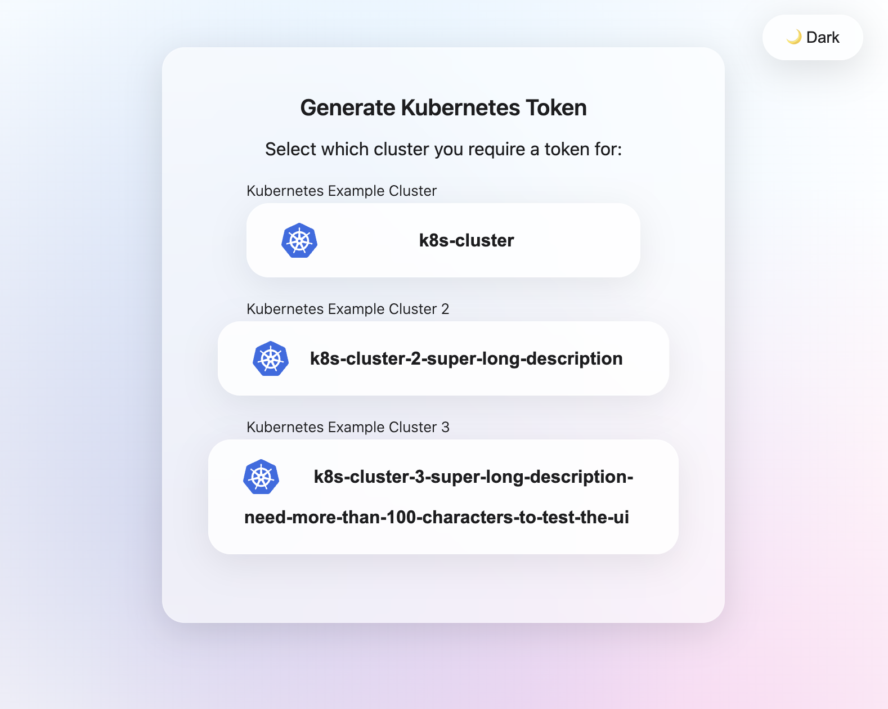
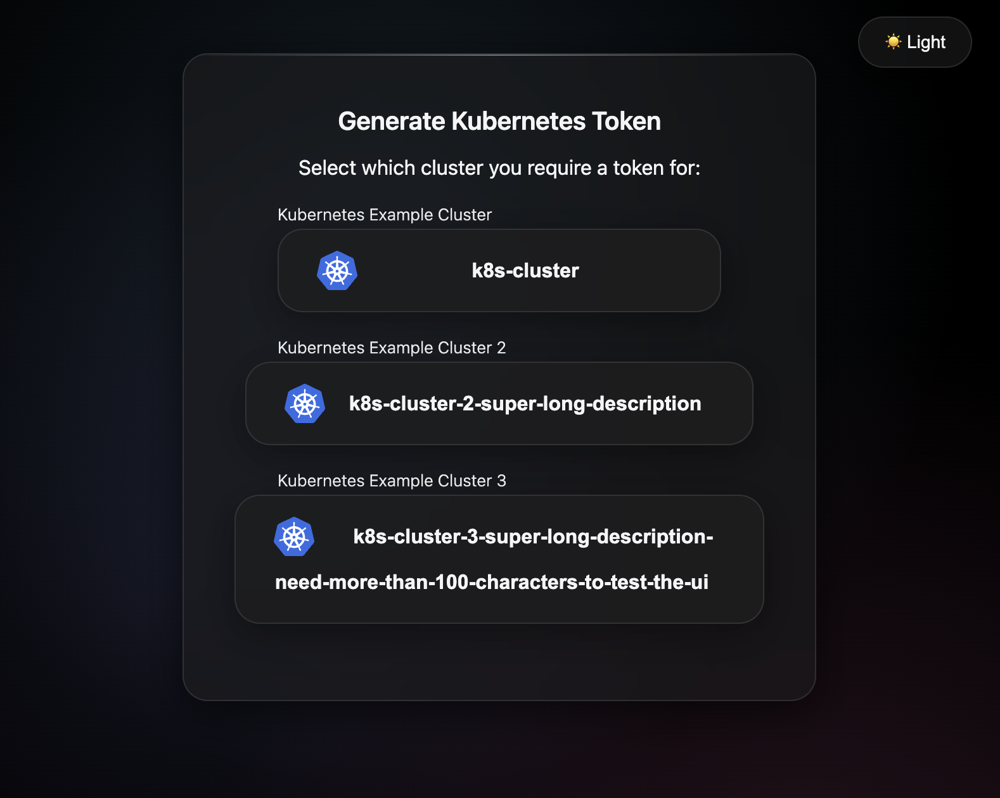
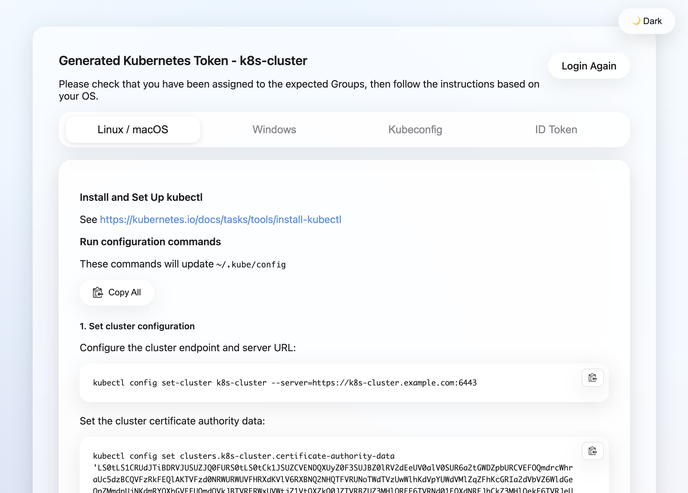
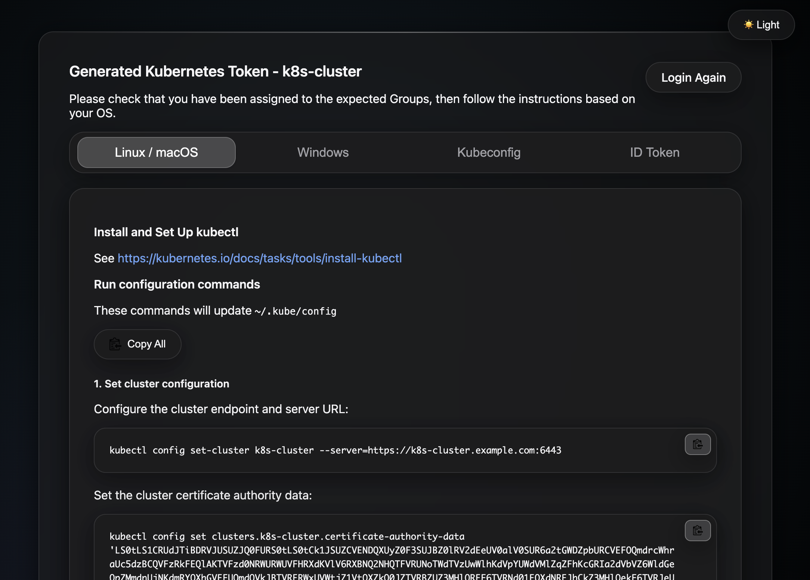

# Dex K8s Authenticator

A helper web-app which talks to one or more [Dex Identity services](https://github.com/dexidp/dex) to generate
`kubectl` commands for creating and modifying a `kubeconfig`.

The Web UI supports generating tokens against multiple cluster such as Dev / Staging / Production.

## Features

- 🎨 **Modern UI** with glassmorphism design and beautiful gradients
- 🌓 **Dark/Light theme** toggle with smooth transitions
- 📋 **Copy to clipboard** functionality for all commands
- 🔐 **Multiple cluster support** (Dev / Staging / Production)
- 🐳 **Docker support** with multi-stage builds
- 📦 **Helm charts** for easy Kubernetes deployment 


## Requirements

- **Go 1.23+** (updated from Go 1.16)
- Modern web browser with JavaScript enabled

## What's New

### Latest Updates (2025)

- ✨ **Updated dependencies** to latest versions:
  - Go 1.23
  - go-oidc v3.10.0 (migrated from v2)
  - cobra v1.8.1
  - viper v1.20.0
- 🎨 **Enhanced UI design**:
  - Beautiful gradient backgrounds for both light and dark themes
  - Improved glassmorphism effects
  - Better visual hierarchy and spacing
- 🐳 **Updated Dockerfile**:
  - Alpine 3.21
  - Go 1.23
- 🔧 **Code improvements**:
  - Replaced deprecated `ioutil` with `os` package
  - Updated OAuth2 context handling for go-oidc v3
  - Fixed Viper configuration type detection

## Also provides
* Helm Charts
* SSL Support
* Linux/Mac/Windows instructions

## Documentation

- [Developing and Running](docs/develop.md)
- [Configuration Options](docs/config.md)
- [Using the Helm Charts](docs/helm.md)
- [SSL Support](docs/ssl.md)

## Screen shots










## Quick Start

### Using Docker

```bash
docker build -t dex-k8s-authenticator .
docker run -p 5555:5555 -v $(pwd)/config.yml:/app/config.yml dex-k8s-authenticator --config /app/config.yml
```

### Building from Source

```bash
go build -o bin/dex-k8s-authenticator dex-auth.go main.go templates.go
./bin/dex-k8s-authenticator --config config.yml
```

### Using Helm

1. **Prepare values file:**
   ```bash
   helm inspect values charts/dex-k8s-authenticator > dex-k8s-authenticator-values.yaml
   ```

2. **Edit `dex-k8s-authenticator-values.yaml`** with your cluster configuration:
   ```yaml
   dexK8sAuthenticator:
     clusters:
     - name: my-cluster
       description: "My Kubernetes Cluster"
       client_secret: "your-client-secret"
       issuer: https://dex.example.com
       k8s_master_uri: https://k8s.example.com
       client_id: my-cluster
       redirect_uri: https://login.example.com/callback/my-cluster
   ```

3. **Install the chart:**
   ```bash
   helm install dex-k8s-authenticator charts/dex-k8s-authenticator \
     --namespace dex \
     --create-namespace \
     --values dex-k8s-authenticator-values.yaml
   ```

4. **Access the application** via Ingress (if enabled) or port-forward:
   ```bash
   kubectl port-forward -n dex svc/dex-k8s-authenticator 5555:5555
   ```

For more details, see [charts/README.md](charts/README.md).

## Contributing

Feel free to raise feature-requests and bugs. PR's are also very welcome.

## License

MIT License - see [LICENSE](LICENSE) file for details.

Based on the original [dex-k8s-authenticator](https://github.com/mintel/dex-k8s-authenticator) by Mintel Group Ltd.

This fork is maintained at [github.com/weisscorp/dex-k8s-authenticator](https://github.com/weisscorp/dex-k8s-authenticator).

## Alternatives

- https://github.com/heptiolabs/gangway
- https://github.com/micahhausler/k8s-oidc-helper
- https://github.com/negz/kuberos
- https://github.com/negz/kubehook
- https://github.com/fydrah/loginapp

This application is based on the original [example-app](https://github.com/coreos/dex/tree/master/cmd/example-app
) available in the CoreOS Dex repo.
